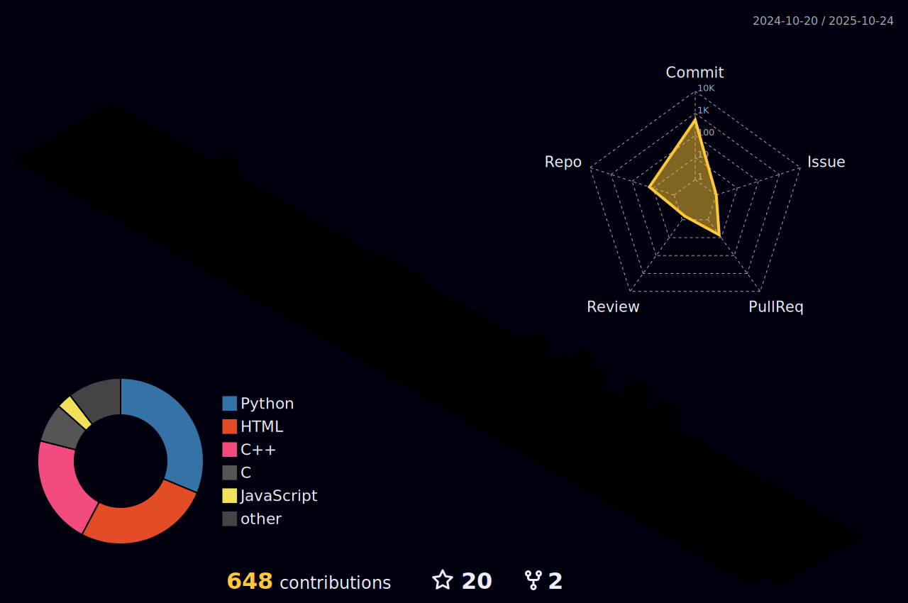

<!-- Profile Banner -->

  

<!-- About Me -->
# 👨‍💻 About Me

I'm Safal Gautam — a Computer Engineering student from the hills of Nepal 🇳🇵.  
Fueled by curiosity, caffeine, and clean code.  
I turn ideas into logic, and logic into elegant digital art.

- 🌍 Based in **Nepal**
- 🧠 Currently learning **Frontend Development**, exploring **C/C++, JavaScript, Python**
- 💬 Ask me about tech, logic gates, or how many bugs I squashed this week
- ✉️ Reach me at: [contact@safalgautam.com.np](mailto:contact@safalgautam.com.np)

 

---

### ⚒️ My Arsenal of Tools

  

---

### 🌐 Let's Connect

  
  
  

---

### 📊 GitHub Stats

  
  

---

### 🔥 GitHub Streak

  

---

### 📈 Contribution Graph

  

---

### 🧊 3D Contribution Chart

  

---

### 🧭 Visitor Counter

  

<b>🚀 Thanks for scrolling — now go build something epic!</b>

